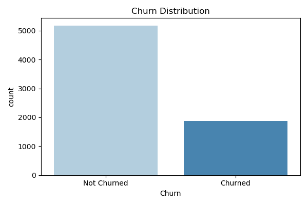
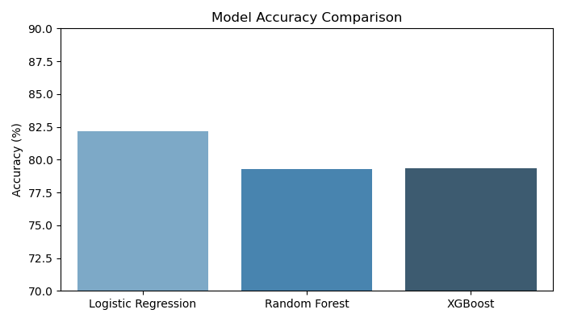
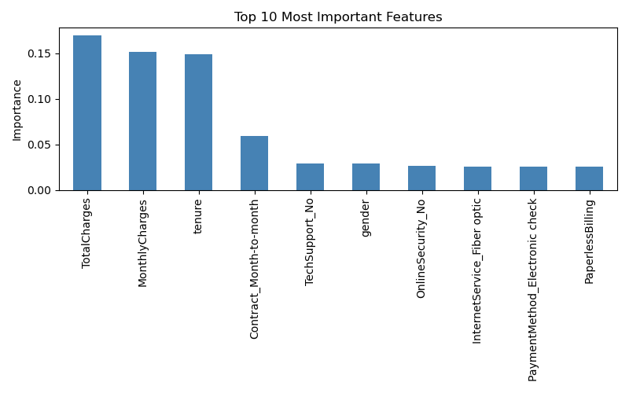

# churn-prediction
Machine learning model to predict customer churn using Logistic Regression, Random Forest and XGBoost
# 📉 Customer Churn Prediction

## 📌 Project Overview
Built a machine learning model to predict which telecom customers 
are likely to cancel their subscription, using a dataset of 7000+ customers.

## 🔧 Tools Used
- Python (Pandas, Scikit-learn, XGBoost, Seaborn)
- Spyder IDE

## 🤖 Models Built
| Model | Accuracy |
|---|---|
| Logistic Regression | 82.19% |
| Random Forest | 79.28% |
| XGBoost | 79.35% |

## 📊 Key Findings
- **Logistic Regression** performed best with 82.19% accuracy
- **Contract type** is the most important factor for churn
- Customers with **month-to-month contracts** churn the most
- **Tenure** and **TotalCharges** are strong predictors

## 📈 Visualizations

## 📁 Project Files
| File | Description |
|---|---|
| `churn.py` | Full code |
| `churn_distribution.png` | Churn vs non-churn chart |
| `model_comparison.png` | Model accuracy comparison |
| `feature_importance.png` | Top 10 important features |

## 🚀 How to Run
1. Clone this repo
2. Install requirements: `pip install pandas scikit-learn xgboost seaborn shap`
3. Run `churn.py` in Spyder or any Python IDE
